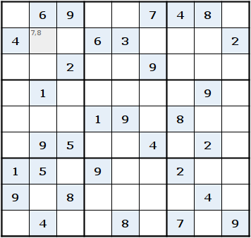
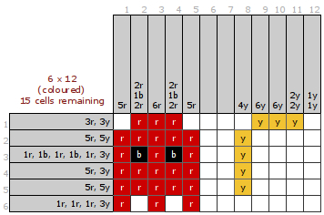

# Spreadsheet Games

Games implemented in a spreadsheet without plugins or macros!

The goal of this project was to show what imagination, passion and creativity can do even with serious tools such as a Spreadsheet.

The objective was to build the spreadsheets with the smallest set of functions and add-ins possible. There are no macros in this first two games, no extra plug-ins, no embedded objects. So far, only formulas and colouring were used.

## Available Projects:

* **Sudoku:** *The objective of Sudoku is to find the missing single-digit numbers (from 1 to 9) for each cell of the puzzle based on the values in other cells. Numbers cannot repeat on the same row, column or subgrid (3x3).*

* **Japanese Nonogram:** *The objective of this game is to find a hidden picture which you can be decipher using the numbers provided on each row and column.*

## Getting Started

Unfortunately, not all Spreadsheet Editors are coded equal. Each spreadsheet editor has their own characteristics and limitations, because they are created by different groups of people. When opening a file in another editor basic formulas normally work fine but more complex data will probably produce an error. Here are the list of functionality for each application

| Application | Version | Notes |
|:---:|:---:|:---|
| LibreOffice |6.1|The most complete from this list. Allows complex Conditional Formatting. Support newest functions such as MINFIS. Processes Regular Expressions|
| Apache OpenOffice|4.1|Very pretty but non standard input entry. Allows complex Conditional Formatting. Missing support newest functions. Lacks Regular Expressions support|
|Excel|2010|Lots of users, reason why I migrated it. Allows some Conditional Formatting with simple styles. Bug found in Conditional Formatting background colour. Support newest functions. Lacks Regular Expressions support |
| Excel|2003|Lots of users, reason why I migrated it. Allows some Conditional Formatting with simple styles. Support newest functions. Lacks Regular Expressions support|
| Google Sheets| May 2020  |Handy to be online but has limitations. Allows some Conditional Formatting with basic styles. Conditional formatting without worksheets references. Support lots of new functions including Google's. Regular Expressions has their own format. Some functions have different defaults|

### Prerequisites

You must have either installed any of the following editors (or use the online version)

* [Libre Office](http://www.libreoffice.org)

* [Apache OpenOffice](http://www.openoffice.org)

* [Microsoft Excel](http://en.wikipedia.org/wiki/Microsoft_Excel)

* [Google Sheets](http://www.google.com/sheets/about)

### Installing

Click in the link below to get the files from this repository:

* Download [Sudoku](Sudoku/)

* Download [Japanese Nonogram](JapaneseNonogram/)

### Availability

Also available from website [Magical Spreadsheets](http://magicalspreadsheets.blogspot.com)

To open the GitHub Page click [here](https://grpistoia.github.io/SpreadsheetGames/)

## Author

**Gustavo Pistoia** - Both games, concept, design, implementation and publishing.

## License

This project is licensed under the Attribution-NonCommercial-NoDerivatives 4.0 International (CC BY-NC-ND 4.0) License - see the [LICENSE](LICENSE.md) file for details.

## Acknowledgments

* Thanks to Dan Bricklin “the Father of the Spreadsheet” and Bob Frankston.
* The Linux and Ubuntu developers
* The LibreOffice developers

